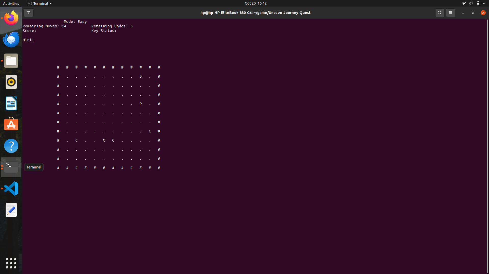
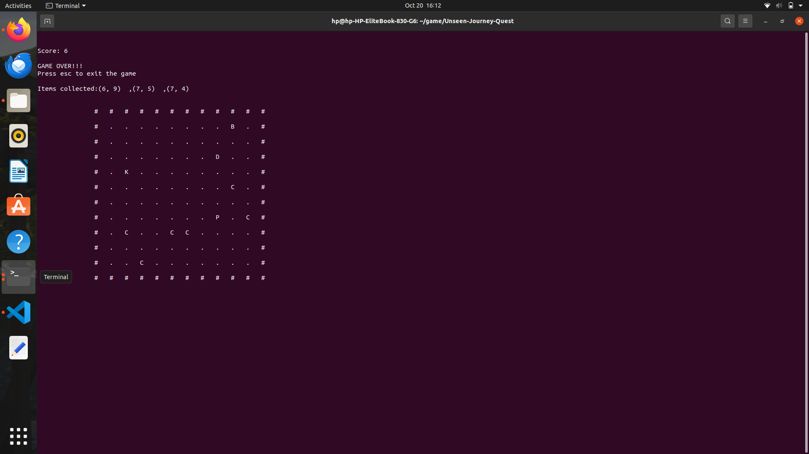
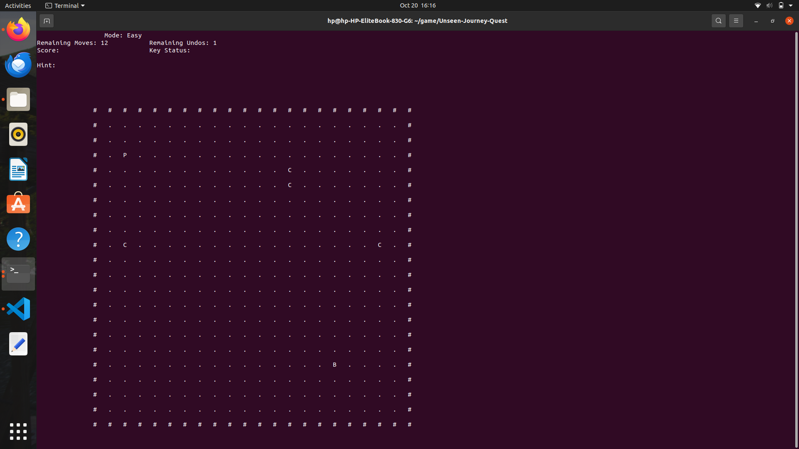
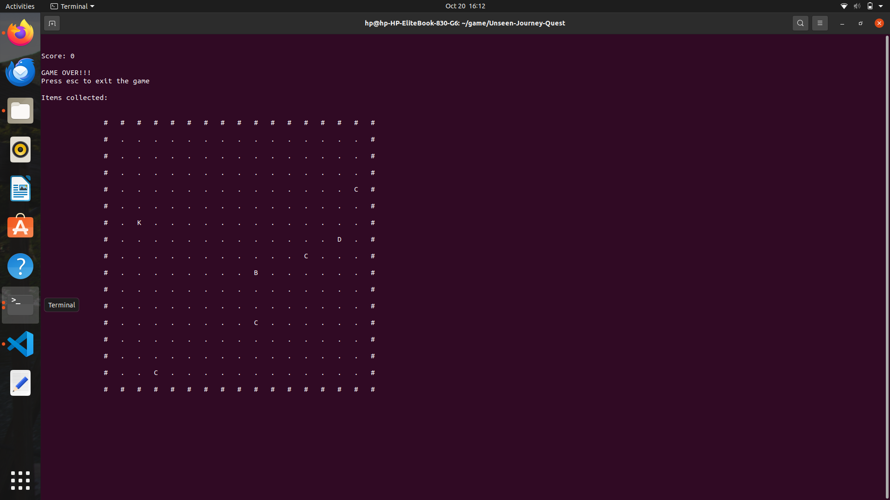
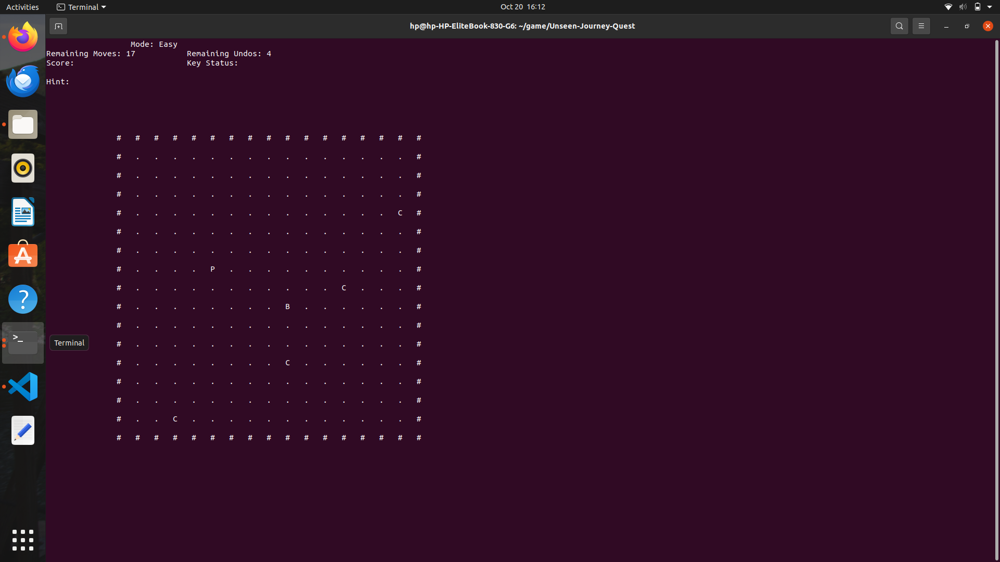
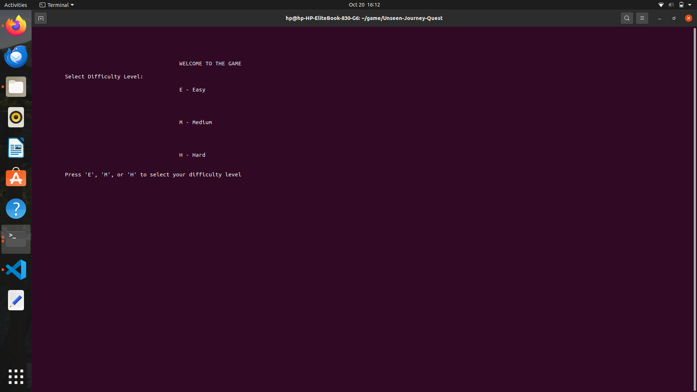

# Unseen-Journey-Quest

## Introduction
Welcome to **Unseen-Journey-Quest Game**! This is an engaging adventure game where players navigate through a grid, collect coins, and solve puzzles to reach the exit. With varying difficulty levels, players can enjoy a challenging experience while honing their problem-solving skills.

## Key Features and Game Mechanics
- **Grid-based Navigation**: Move through a 10x10 grid filled with obstacles and treasures.
- **Coin Collection**: Gather coins to increase your score and gain additional undo moves.
- **Dynamic Coin Regeneration**: Coins regenerate over time, offering players new opportunities for collection.
- **Undo Feature**: Players can use a limited number of undos to retry their last move.
- **Difficulty Levels**: Choose from Easy, Medium, or Hard, affecting grid size, number of moves, and undo limits.
- **Game Over Conditions**: Various conditions determine the end of the game, including running out of moves or reaching the exit.

## Instructions to Run the Game
1. Ensure you have a C++ compiler installed (e.g., g++, clang++).
2. Clone the repository:
   ```bash
   git clone https://github.com/Minahil-18/Unseen-Journey-Quest.git
   cd Unseen-Journey-Quest

## easy

## gameover

## hard

## lose

## medium

## menu
